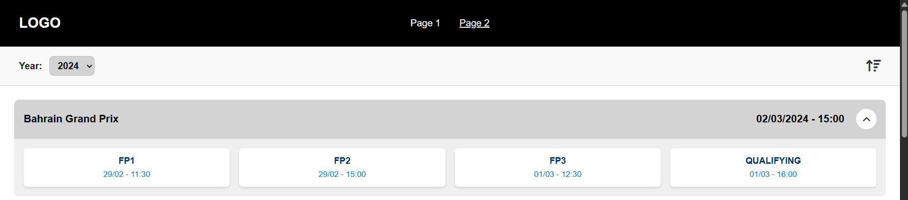

<div align="center">
  
  <h1>RaceViewer</h1>
  <p>Uma aplicação Vue 3 + Vite que consome a API pública de Fórmula 1 (Subistituta a Ergast API) e exibe corridas em formato de acordeão moderno, com preload inteligente e ordenação dinâmica.</p>

  <p align="center">
    
    
    
  </p>
</div>

---

## 📸 Preview



---

## 🚀 Funcionalidades

- ⚡️ Consome dados ao vivo da substituta da [Ergast F1 API](https://api.jolpi.ca/ergast/f1/2024.json)
- 🎛️ Interface de filtragem por ano e ordenação crescente/decrescente
- 📦 Accordion moderno com animação suave de abertura
- 💡 Preloader exibido somente no container afetado
- 🌐 Responsividade total e compatibilidade mobile
- 🧠 Código modularizado com Vue 3 e `<script setup>`
- 📁 Estrutura de diretórios organizada

---

## 📂 Estrutura do Projeto
```
baseLayout/
├── public/
│ └── assets/
│ └── images/
│ └── screenshot-accordion.png
├── src/
│ ├── components/
│ ├── views/
│ ├── App.vue
│ └── main.js
├── package.json
├── README.md
└── vite.config.js
````

---

## 🛠️ Tecnologias Utilizadas

| Tecnologia | Descrição |
|------------|-----------|
| [Vue 3](https://vuejs.org/) | Framework progressivo JavaScript |
| [Vite](https://vitejs.dev/) | Ferramenta de build ultrarrápida |
| [Substituta a Ergast API](https://api.jolpi.ca/ergast/f1/2024.json) | Fonte de dados da F1 |
| [FontAwesome](https://fontawesome.com/) | Ícones dinâmicos e visuais |
| HTML5, CSS3, JavaScript | Fundamentos da Web |

---

🔗 Endpoints Utilizados
```
https://api.jolpi.ca/ergast/f1/${selectedYear.value}.json
```

## 🔧 Instalação


``` bash
# Clone o repositório
git clone git@github.com:danilosamba/baseLayout.git
cd baseLayout

# Instale as dependências
npm install

# Execute localmente
npm run dev 
```


## ✅ Considerações finais
O endpoint inicialmente proposto no exercicio (https://ergast.com/api/f1/2024.json) foi descontinuado,
em pesquisa constatei que foi em definitivo, no entanto, utilizei o endpoint substituto
https://api.jolpi.ca/ergast/f1/2024.json


<div align="center">
Feito com ❤️ por Danilo Miranda
</div>


